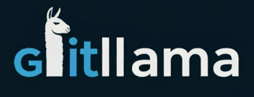

 

GitLlama is an AI-powered tool that revolutionizes how developers interact with and understand Git repositories.

## Inspiration

The inspiration for GitLlama came from common pain points in software development:

1. Code Review Complexity: Developers often struggle to quickly understand the context and impact of changes in pull requests, especially for large commits.

2. Repository Exploration: New team members or developers returning to a project after a while find it challenging to grasp the overall structure and recent changes in a repository.

3. Knowledge Silos: Important details about code changes often remain in the heads of individual developers, making it difficult for teams to maintain a shared understanding of the project.

4. Time Consumption: Manually going through commit histories and trying to understand the evolution of a codebase is extremely time-consuming.

5. Non-Technical Stakeholder Communication: It's challenging to provide clear, concise updates about technical progress to non-technical team members or clients.

These challenges inspired us to create a tool that leverages AI to provide quick, meaningful insights into code repositories, making them more accessible and understandable to all team members.

[](https://reactjs.org/)
[](https://flask.palletsprojects.com/)
[](https://www.python.org/)


## 🚀 Features

- **💬 AI-Powered Chatbot**
  - Ask natural language questions about your repo
  - Get context-aware answers instantly

- **📊 Commit Summarization**
  - Generate concise, intelligent summaries of any commit
  - Understand changes at a glance

- **🔬 Repository Analysis**
  - Get comprehensive overviews of entire codebases
  - Visualize code structure and complexity

## 🛠️ Built With

- **Frontend:** [React](https://reactjs.org/)
- **Backend:** [Flask](https://flask.palletsprojects.com/)
- **AI/ML:** 
  - [Pinecone](https://www.pinecone.io/) for vector search capabilities
  - [Together AI](https://www.together.ai/) for LLama3.2 endpoint
- **Version Control:** Git (via [GitPython](https://gitpython.readthedocs.io/))

## 🏁 Getting Started

### Prerequisites

- Python 
- Flask
- Llamaindex
- Pinecone
- React
- Git
- Together ai

### Installation

1. Clone the repo
   ```sh
   git clone https://github.com/Atharva-Weginwar/GitLlama.git

2. Install Python dependencies
   ```sh
   pip install -r requirements.txt
   
3. Install React dependencies
   ```sh
   cd frontend
   npm install

4. Run the application
   ```sh
   # Start the Flask backend
    cd backend
    python app.py

    # In a new terminal, start the React frontend
    cd frontend
    npm start


Visit http://localhost:5173 to see GitLlama in action!
🎮 Usage
Chatbot Interface

Navigate to the Chatbot tab
Type your question about the repository (e.g., "What changes were made to the login functionality last week?")
Hit enter and wait for the AI-generated response

Commit Summary

Go to the Commits tab
Click on any commit in the list
View the AI-generated summary, including key changes and potential impacts

Repository Analysis

Navigate to the Analysis tab
Click "Analyze Repository"
Wait for the comprehensive analysis to complete
Explore the generated visualizations and insights


